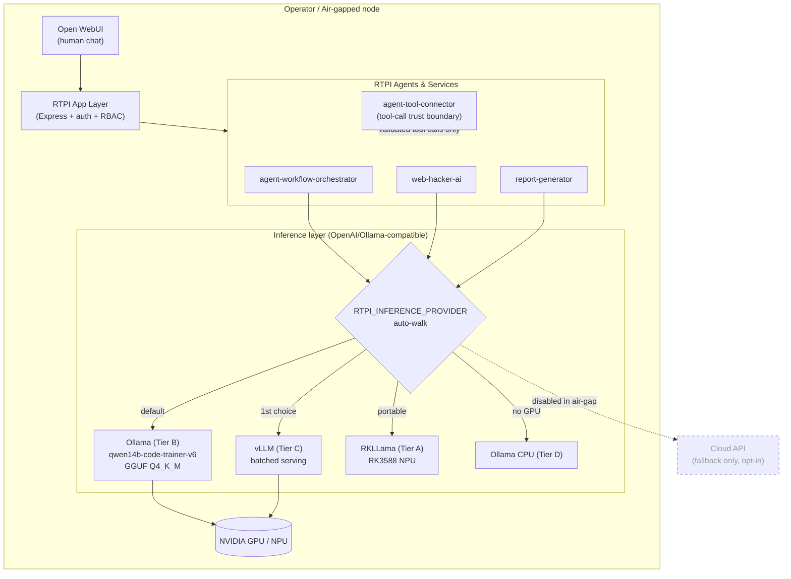
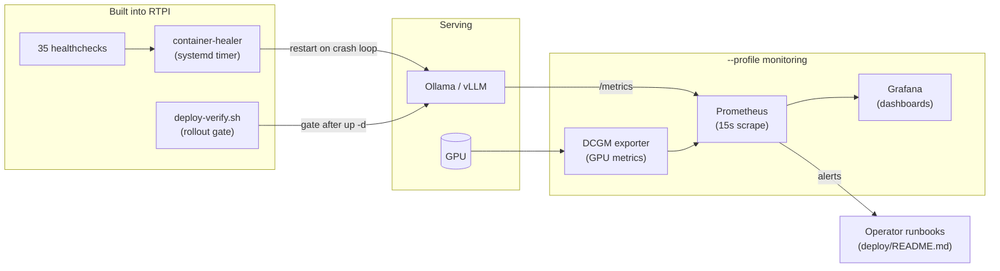
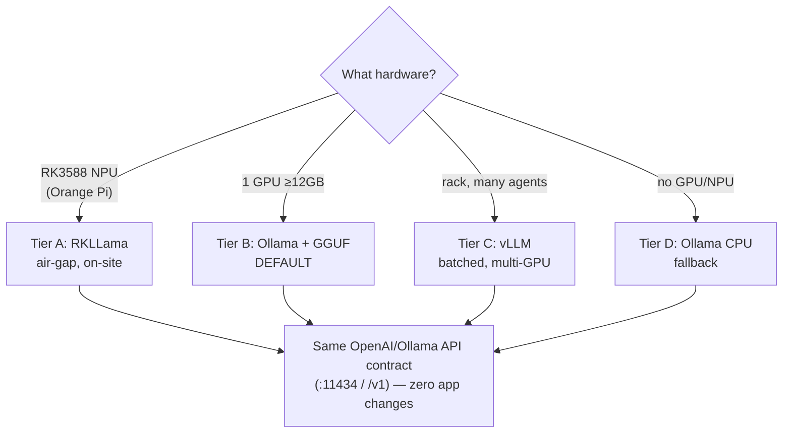

# Architecture Diagrams

Supporting diagrams for [`../deployment-plan.md`](../deployment-plan.md). Rendered with Mermaid (GitHub-native).

## 1. System architecture — model serving inside RTPI



## 2. Request flow — a single agent tool-use turn

```mermaid
sequenceDiagram
    participant A as RTPI Agent
    participant R as Inference Router
    participant M as qwen14b-code-trainer-v6
    participant V as agent-tool-connector
    participant T as Security Tool (MCP)

    A->>R: chat/completions (prompt + tool schema)
    R->>M: route to local backend (Ollama/vLLM)
    M-->>R: tool call (e.g. run_nuclei{...})
    R-->>A: parsed tool call
    A->>V: request tool execution
    V->>V: validate against allow-listed schema + scope
    alt valid & in-scope
        V->>T: execute
        T-->>V: result
        V-->>A: result
    else invalid / out-of-scope
        V-->>A: rejected (trust boundary)
    end
    Note over M,V: Model only *suggests*; connector *authorizes*. (plan §6.4)
```

## 3. Monitoring & self-healing topology



## 4. Deployment tiers (decision view)


