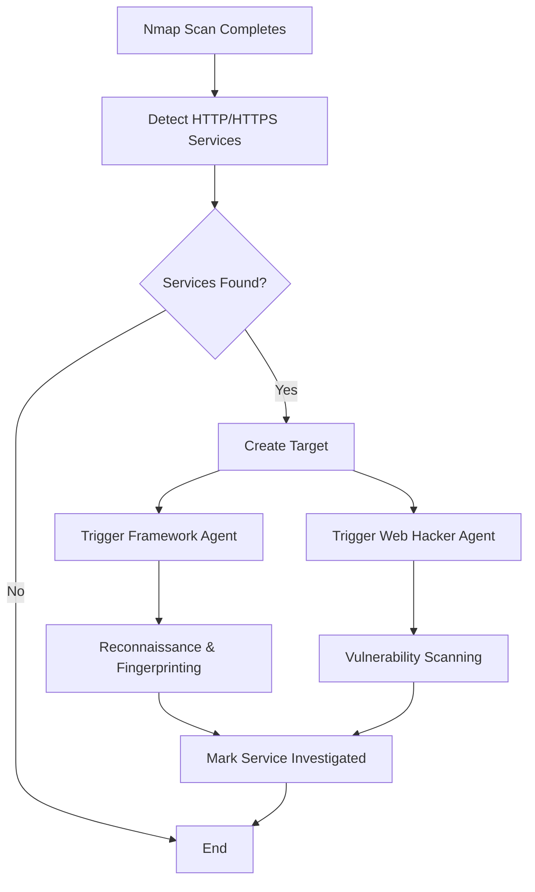

# HTTP/HTTPS Service Detection Automation (v2.3.6.2)

## Overview

The HTTP/HTTPS Service Detection Automation automatically detects web services (HTTP/HTTPS) discovered during network scans and triggers targeted investigation by the **Framework Agent** and **Web Hacker Agent**.

## Architecture

### Trigger Points

The automation is triggered when:

1. **Nmap scan completes** - Detects open ports 80, 443, 8080, 8443, etc.
2. **Targets are auto-created** - After BBOT discovers assets
3. **Services are manually added** - When services are added to the discoveredServices table

### Detection Ports

**HTTP Ports (default):**
- 80, 8000, 8008, 8080, 8888, 3000, 5000, 9000

**HTTPS Ports (default):**
- 443, 8443, 3443, 9443

### Workflow



## Agent Actions

### Framework Agent Tasks

When an HTTP/HTTPS service is detected, the Framework Agent performs:

1. **HTTP Fingerprinting** (`httpx`)
2. **Technology Detection** (`whatweb`, `wappalyzer`)
3. **CMS Detection**
4. **Directory Enumeration** (`dirsearch`)
5. **Service Version Scanning** (`nmap`)

### Web Hacker Agent Tasks

The Web Hacker Agent performs:

1. **Nuclei Vulnerability Scanning**
2. **XSS Detection**
3. **SQL Injection Detection**
4. **SSRF Detection**
5. **Custom Template Generation** (if needed)

## Configuration

### Default Configuration

```typescript
{
  enabled: true,
  triggerFrameworkAgent: true,
  triggerWebHackerAgent: true,
  createTargets: true,
  minDelayBetweenTriggers: 2000, // 2 seconds
  httpPorts: [80, 8000, 8008, 8080, 8888, 3000, 5000, 9000],
  httpsPorts: [443, 8443, 3443, 9443]
}
```

### Customization

You can customize the configuration by modifying the automation instance:

```typescript
import { httpServiceDetectionAutomation } from './http-service-detection-automation';

// Disable framework agent
httpServiceDetectionAutomation.updateConfig({
  triggerFrameworkAgent: false
});

// Add custom ports
httpServiceDetectionAutomation.updateConfig({
  httpPorts: [80, 8000, 8008, 8080, 8888, 3000, 5000, 9000, 8008],
  httpsPorts: [443, 8443, 3443, 9443, 8444]
});
```

## Database Integration

### Target Creation

When a service is detected, a new target is automatically created with:

```typescript
{
  name: "HTTPS Service - example.com:443",
  type: "url",
  value: "https://example.com",
  tags: ['http-service', 'https', 'port-443', 'auto-created', 'pending-investigation'],
  priority: 5,
  autoCreated: true,
  metadata: {
    serviceId: "<service-id>",
    port: 443,
    protocol: "https",
    serviceName: "https",
    autoCreatedAt: "2026-03-13T05:56:00.000Z",
    autoCreatedBy: "http-service-detection-automation"
  }
}
```

### Service Metadata Update

The discovered service is marked as investigated:

```typescript
{
  investigated: true,
  investigatedAt: "2026-03-13T05:56:00.000Z",
  investigatedBy: "http-service-detection-automation",
  targetId: "<target-id>",
  targetCreatedAt: "2026-03-13T05:56:00.000Z"
}
```

## Event System

The automation emits the following events:

### `services_detected`

Emitted when HTTP/HTTPS services are found:

```typescript
{
  operationId: string,
  count: number,
  services: HttpServiceDetection[]
}
```

### `service_processed`

Emitted when a service has been processed:

```typescript
{
  operationId: string,
  serviceId: string,
  result: InvestigationResult
}
```

### `operation_processed`

Emitted when all services in an operation have been processed:

```typescript
{
  operationId: string,
  results: InvestigationResult[]
}
```

## Rate Limiting

To prevent overwhelming the system, the automation implements:

- **Minimum delay between triggers**: 2 seconds (configurable)
- **Processing queue**: Prevents duplicate processing of the same service
- **Concurrent processing check**: Services already being processed are skipped

## Integration with Workflow Event Handlers

The automation is automatically initialized during server startup via the `workflow-event-handlers.ts` initialization:

```typescript
// Initialize HTTP Service Detection Automation (v2.3.6.2)
try {
  const { initializeHttpServiceDetectionAutomation } = await import('./http-service-detection-automation');
  await initializeHttpServiceDetectionAutomation();
  console.log('HTTP Service Detection Automation initialized');
} catch (error) {
  console.error('Failed to initialize HTTP Service Detection Automation:', error);
}
```

## Example Usage

### Manual Trigger

```typescript
import { httpServiceDetectionAutomation } from './http-service-detection-automation';

// Process all HTTP/HTTPS services for an operation
const results = await httpServiceDetectionAutomation.processOperation(operationId);

console.log(`Processed ${results.length} services`);
console.log(`Triggered: ${results.filter(r => r.status === 'triggered').length}`);
console.log(`Errors: ${results.filter(r => r.status === 'error').length}`);
```

### Event Listening

```typescript
import { httpServiceDetectionAutomation } from './http-service-detection-automation';

httpServiceDetectionAutomation.on('services_detected', (data) => {
  console.log(`Found ${data.count} HTTP/HTTPS services in operation ${data.operationId}`);
});

httpServiceDetectionAutomation.on('service_processed', (data) => {
  console.log(`Processed service: ${data.serviceId}`);
  if (data.result.targetCreated) {
    console.log(`  - Target created: ${data.result.targetId}`);
  }
  if (data.result.frameworkAgentTaskId) {
    console.log(`  - Framework Agent task: ${data.result.frameworkAgentTaskId}`);
  }
  if (data.result.webHackerAgentTaskId) {
    console.log(`  - Web Hacker Agent task: ${data.result.webHackerAgentTaskId}`);
  }
});
```

## Error Handling

The automation implements robust error handling:

1. **Service-level errors**: Each service is processed independently. Errors in one service don't affect others.
2. **Agent delegation fallback**: If Operations Manager is unavailable, the system falls back to creating vulnerability targets for the Web Hacker Agent.
3. **Graceful degradation**: If an agent is not available, the automation continues with remaining agents.

## Logging

The automation provides detailed logging:

```
[HttpServiceDetection] Processing operation abc-123
[HttpServiceDetection] Found 5 HTTP/HTTPS services
[HttpServiceDetection] Processing https://example.com
[HttpServiceDetection] Created target xyz-456 for https://example.com
[HttpServiceDetection] Triggered framework agent task task-789
[HttpServiceDetection] Triggered web hacker agent task task-012
[HttpServiceDetection] Processed 5 HTTP/HTTPS services: 5 triggered, 0 skipped, 0 errors
```

## Performance Considerations

- **Rate limiting**: 2-second delay between service processing
- **Duplicate prevention**: Services already being processed are skipped
- **Batch processing**: Operations process all services in a single call
- **Asynchronous execution**: Agent tasks run asynchronously

## Security Considerations

1. **Service validation**: Only open services are processed
2. **Operation-scoped**: All actions are scoped to the operation
3. **Audit trail**: All actions are logged and tracked
4. **Metadata tracking**: Service investigation status prevents duplicate processing

## Future Enhancements

1. **Machine Learning**: Learn which services are most likely to have vulnerabilities
2. **Priority Scoring**: Prioritize services based on technology stack
3. **Custom Rules**: Allow users to define custom detection rules
4. **Integration with Threat Intelligence**: Cross-reference detected services with known vulnerabilities
5. **Configurable Agent Selection**: Allow users to choose which agents to trigger per service type

## Related Documentation

- [Workflow Event Handlers](./WORKFLOW-EVENT-HANDLERS.md)
- [Framework Agent](../../agents/FRAMEWORK-AGENT.md)
- [Web Hacker Agent](../../agents/WEB-HACKER-AGENT.md)
- [Operations Manager Agent](../../agents/OPERATIONS-MANAGER-AGENT.md)

## Changelog

### v2.3.6.2 (2026-03-13)

- Initial implementation
- Automatic HTTP/HTTPS service detection
- Framework Agent integration
- Web Hacker Agent integration
- Event-driven architecture
- Rate limiting and duplicate prevention
