# v2.9.1 — Platform Completion Requirements

**Created:** 2026-04-28
**Status:** Planning
**Priority:** HIGH — closes v2.9 release scope

## Overview

This release closes nine outstanding completion requirements identified during v2.9 walkthrough screenshots into a single coordinated rollout: reorganize the Intelligence sidebar, connect security frameworks (OWASP LLM Top 10, NIST AI RMF, CIS Controls v8) to tools and agents, fix the Reports↔Sysreptor wiring, add Docmost team docs, ship app-side PDF generation, build a vectorized CTI knowledge base with automatic ATLAS STIX import, replace the agent inference path with vLLM-served Qwen3.5-9B + Qwen-Agent (per [Inference-Agent-Architecture.md](references/Inference-Agent-Architecture.md)), repair the container-app exec/error path, add per-framework Deploy/Teardown automation, and harden KASM workspaces with nested container support.

The work breaks into **10 phases across 6 parallel lanes**. Phase 0 lands a feature-flag scaffold (`/api/v1/settings/features`) so subsequent phases can ship behind flags without destabilizing main. All schema changes are additive (non-destructive). vLLM ships behind `RTPI_INFERENCE_PROVIDER=vllm` so failure does not block the rest of v2.9.1.

---

# Reorganize Intelligence
## Category Order

```
Offsec Team R&D
CTI
Frameworks
Reports
```

### Engineering Scaffold — Phase 1: Sidebar reorder + `/cti` page stub

- **Goal:** Achieve the required Intelligence ordering and create a CTI landing page that Phase 7 populates.
- **Work items:**
  - Extract `navGroups` array out of `client/src/components/layout/Sidebar.tsx:52-113` into new `client/src/config/nav-groups.ts` (seam **S10**).
  - Reorder Intelligence group entries to `[Offsec Team R&D, CTI, Frameworks, Reports]`.
  - Add `client/src/pages/CTI.tsx` — empty tabbed shell: Feeds | Indicators | Reports | Search.
  - Register `/cti` route in `client/src/App.tsx`.
- **API additions:** none.
- **Schema changes:** none.
- **Acceptance:**
  - Sidebar order matches spec; `/cti` returns 200 with empty shell.
  - Lint + typecheck pass; no a11y regressions.
- **Effort:** S. **Flag:** none (UI-only, safe).

---

# Intelligence
## Offsec Team R&D

### Engineering Scaffold — no-op

- Existing `/offsec-rd` page (`client/src/pages/OffSecTeam.tsx`) is unchanged in v2.9.1.
- API surface preserved: `server/api/v1/offsec-rd-projects.ts`, `offsec-rd-experiments.ts`, `offsec-rd-knowledge.ts`, `offsec-rd-tools.ts`.
- Sidebar position changes per Phase 1.

## CTI

### Engineering Scaffold — Phase 7 anchor

- This section is populated end-to-end by Phase 7 (Vectorized CTI Feeds + Automatic STIX Import — see below). Phase 1 only ships the empty shell.
- New page tabs: **Feeds** (sources + ingestion runs), **Indicators** (item table with filters), **Reports** (CTI digests), **Search** (semantic search via `/api/v1/knowledge/search`).

## Frameworks
### Connect OWASP LLM Top 10 to tools and agent
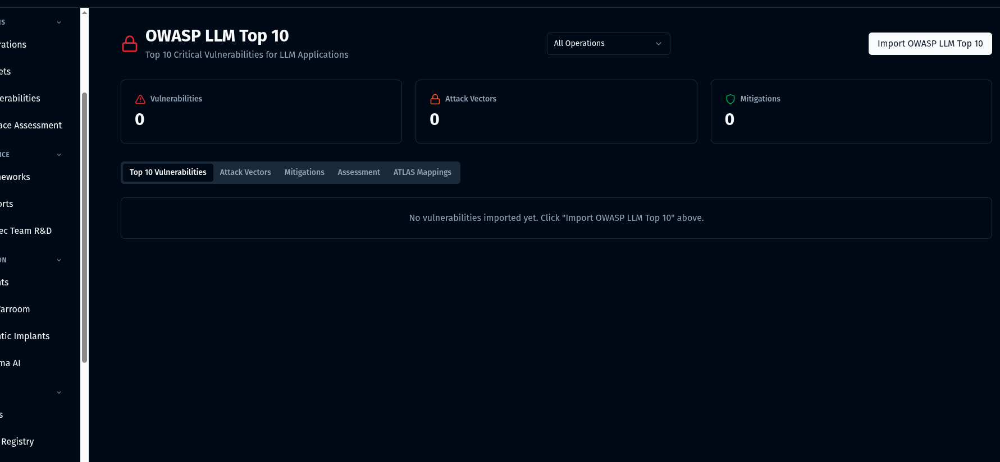

### Implement NIST AI RMF

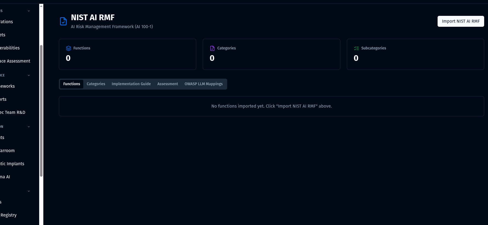

### Implement CIS Controls v8

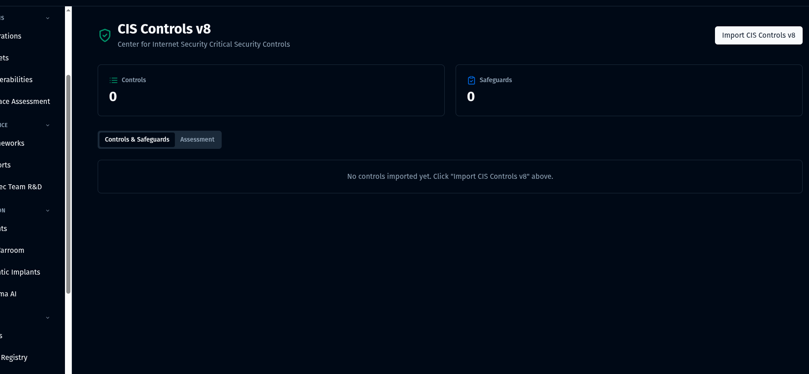

### Engineering Scaffold — Phase 4: Framework→tools/agents bindings UI

- **Goal:** Let users connect OWASP LLM Top 10, NIST AI RMF, and CIS Controls v8 controls to specific tools and agents.
- **Reuses:** existing `frameworkMappings` and `operationFrameworkCoverage` tables; `server/api/v1/framework-mappings.ts`; parsers `server/services/{owasp-llm-parser,nist-ai-rmf-parser,cis-parser}.ts`; pages `OWASPLLMFramework.tsx`, `NISTAIFramework.tsx`, `CISFramework.tsx`.
- **Work items:**
  - Add seam **S4** `server/services/frameworks/framework-binding-service.ts` (CRUD + reverse lookup).
  - New component `client/src/components/frameworks/FrameworkBindingsPanel.tsx` — multi-select tools (from `/api/v1/tools`), multi-select agents (from `/api/v1/agents`), pick `binding_kind` (`primary`/`supports`/`validates`).
  - Embed panel in each framework page.
- **API additions:**
  - `GET /api/v1/frameworks/:type/:externalId/bindings` — list bindings for a control.
  - `POST /api/v1/frameworks/bindings` — create [admin].
  - `DELETE /api/v1/frameworks/bindings/:id` — remove [admin].
  - `GET /api/v1/tools/:id/frameworks` — reverse lookup.
  - `GET /api/v1/agents/:id/frameworks` — reverse lookup.
- **Schema changes:** migration `0033_extend_framework_bindings.sql` — new `framework_bindings` table: `id uuid pk`, `framework_type text` (`owasp_llm`/`nist_ai`/`cis_v8`/`atlas`/`attck`), `framework_element_external_id text`, `binding_kind text` (`tool`/`agent`/`workflow`), `target_id uuid`, `confidence real`, `rationale text`, `created_by`, `created_at`. Unique index on `(framework_type, framework_element_external_id, binding_kind, target_id)`.
- **Acceptance:**
  - User binds a tool+agent to OWASP LLM01; persists across reload.
  - Same flow works for NIST AI RMF subcategories and CIS Safeguards.
  - Reverse lookup returns the bound control from a tool/agent ID.
- **Effort:** M. **Flag:** none (additive).

## Reports
### Connect Reports-Sysreptor

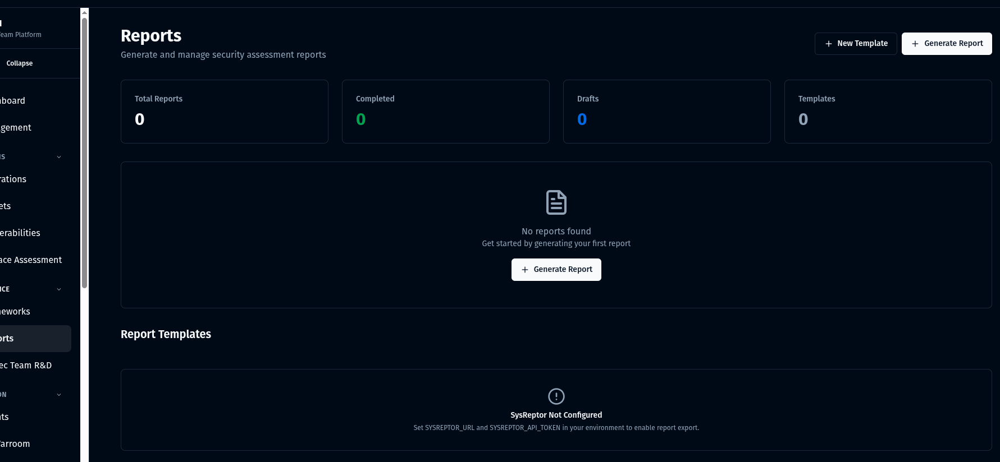

### Engineering Scaffold — Phase 2: Sysreptor health endpoint + Reports banner

- **Goal:** Fix the documented Reports → Sysreptor connection bug and surface integration health in the UI.
- **Reuses:** `server/services/sysreptor-client.ts`, `server/api/v1/sysreptor.ts`, `client/src/hooks/useSysReptor.ts`, `client/src/services/sysreptor.ts`.
- **Work items:**
  - Modify `server/services/sysreptor-client.ts` — add health check, retries with backoff, surface auth/profile errors with actionable messages instead of opaque 500s.
  - Modify `server/api/v1/sysreptor.ts` — add `GET /sysreptor/health` returning `{up, profileEnabled, version}` triple.
  - Modify `client/src/pages/Reports.tsx` — render banner when `health.up=false` with diagnostic + remediation copy; embed Sysreptor project list and "Open in Sysreptor" deeplink.
  - Modify `docker-compose.yml` — confirm Sysreptor `depends_on db`, healthcheck present, restart policy.
- **API additions:** `GET /api/v1/sysreptor/health`.
- **Schema changes:** none.
- **Acceptance:**
  - Reports page shows green banner when Sysreptor up; red banner with remediation when down.
  - `docker compose stop sysreptor` → UI degrades gracefully without 500.
  - Project list paginates from real Sysreptor API.
- **Effort:** M. **Flag:** none (bug fix).

### Docmost for Team Documentation
[Docmost Github](https://github.com/docmost/docmost)
[Docmost Docs](https://docmost.com/docs/)

### Engineering Scaffold — Phase 8: Docmost integration

- **Goal:** Add Docmost as a profile-gated service for team docs; link from Reports.
- **Work items:**
  - Modify `docker-compose.yml` — add `docmost` + `docmost-redis` services under `--profile docmost` with persistent volume.
  - New `server/services/integrations/docmost-client.ts` — minimal REST client (workspace list, page create, page link, token exchange).
  - New `server/api/v1/docmost.ts` — `GET /docmost/health`, `POST /docmost/pages` (create page from report).
  - Modify `client/src/pages/Reports.tsx` — add "Open in Docmost" + "Publish to Docmost" actions.
  - Optional new `client/src/pages/Docs.tsx` — embed Docmost via iframe (reverse-proxied).
- **API additions:**
  - `GET /api/v1/docmost/health`.
  - `POST /api/v1/docmost/pages` [operator].
- **Schema changes:** none (state lives in Docmost).
- **Acceptance:**
  - `docker compose --profile docmost up -d` brings Docmost online.
  - "Publish to Docmost" creates a page reachable in Docmost UI.
  - Health surfaces in Reports page.
- **Effort:** M. **Flag:** `RTPI_DOCMOST_ENABLED`.

### App PDF generation
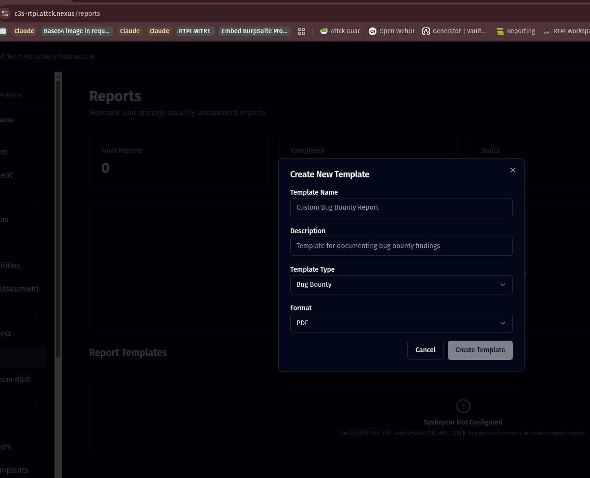

### Engineering Scaffold — Phase 3: Native PDF without Sysreptor dependency

- **Goal:** Generate PDFs server-side using a Chromium sidecar so Reports work without a live Sysreptor instance.
- **Reuses:** `server/services/pdf-report-generator.ts` scaffold (line ~18 has `puppeteer` import commented out).
- **Work items:**
  - Add `puppeteer-core` to `package.json` (avoid bundling Chromium).
  - Add `chromium-headless-shell` sidecar service to `docker-compose.yml` on a private network.
  - New seam **S8** `server/services/reports/document-renderer.ts` — `renderToPdf(html, opts)` connecting to the sidecar via WebSocket; browser pool; disk-cache + cleanup.
  - Refactor `server/services/pdf-report-generator.ts` — owns template assembly only; delegates render to `documentRenderer`.
  - Modify `server/api/v1/reports.ts` — async job endpoints.
  - Modify `client/src/pages/Reports.tsx` — "Generate PDF" button gated on `FF_PDF_NATIVE`; progress indicator polling job endpoint.
- **API additions:**
  - `POST /api/v1/reports/:id/pdf` — returns `{jobId}`.
  - `GET /api/v1/reports/jobs/:jobId` — status.
  - `GET /api/v1/reports/jobs/:jobId/download` — stream the PDF.
- **Schema changes:** migration `0032_add_pdf_jobs.sql` — `pdf_jobs(id, report_id, status, file_path, error, created_at)`.
- **Acceptance:**
  - PDF renders in <30s for a 50-page report.
  - Job status survives app restart (persisted).
  - File cleanup after 24h.
  - Renders cleanly in headless Linux container.
- **Effort:** M. **Flag:** `FF_PDF_NATIVE`.

---

# Implement knowledge
## [Vectorized CTI Feeds](references/CTI-Intel-Agent-TDD-v0.3-Purple.docx)

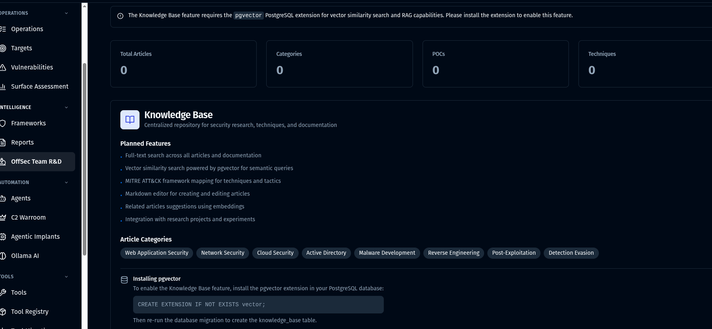

[CTI-Intel-Agent-TDD-v0.3-Purple.docx](references/CTI-Intel-Agent-TDD-v0.3-Purple.docx)

### Engineering Scaffold — Phase 7 (part 1 of 2): CTI feeds + vector search

- **Goal:** Populate `/cti` with vectorized feeds per the TDD; semantic search across CTI items.
- **Reuses:** pgvector (migration `0030_enable_pgvector.sql`); `memoryEntries.embeddingVec` (`vector(1536)`); `server/services/memory-service.ts`; `server/services/mem0-api-client.ts`.
- **Work items:**
  - New seam **S6** `server/services/knowledge/cti-feed-ingestor.ts` — cron-driven (`node-cron`); pulls TAXII collections + RSS feeds; dedup by `(source_id, external_id, content_hash)`.
  - New `server/services/knowledge/taxii-client.ts` — TAXII 2.1 collection poller.
  - New `server/services/knowledge/embedder.ts` — calls active inference provider's `embed()`; writes to `memoryEntries.embedding_vec`.
  - New `server/api/v1/cti.ts` — feeds CRUD, items list, manual refresh.
  - New `server/api/v1/knowledge.ts` — semantic search.
  - Wire CTI page (`client/src/pages/CTI.tsx`) Feeds tab and Search tab.
  - Use `@tanstack/react-query` (already installed) for new surfaces only — seam **S9** `client/src/lib/query.ts`.
- **API additions:**
  - `GET/POST/PATCH /api/v1/cti/sources` (admin for write).
  - `POST /api/v1/cti/sources/:id/refresh` [operator].
  - `GET /api/v1/cti/items?source=&q=&limit=&offset=`.
  - `GET /api/v1/cti/runs?source=`.
  - `POST /api/v1/knowledge/search` — body `{q, k, filters}`.
  - `GET /api/v1/knowledge/stats`.
- **Schema changes:** migration `0034_cti.sql`:
  - `cti_sources(id, name unique, kind, url, auth_ref, enabled, cadence_seconds, last_run_at, created_by)`.
  - `cti_ingestion_runs(id, source_id fk, started_at, finished_at, status, items_seen, items_new, items_updated, error_message)`.
  - `cti_items(id, source_id fk, external_id, title, summary, published_at, link, tags jsonb, content_hash, memory_entry_id fk → memory_entries.id)`.
  - HNSW index on `memory_entries.embedding_vec` (if not already present).
- **Acceptance:**
  - Adding a TAXII feed URL pulls and stores within 5min.
  - `/api/v1/knowledge/search?q="phishing"` returns ranked items.
  - `EXPLAIN` shows HNSW scan, not seq scan.
- **Effort:** XL. **Flag:** `RTPI_CTI_ENABLED`.

# Automatic STIX Import
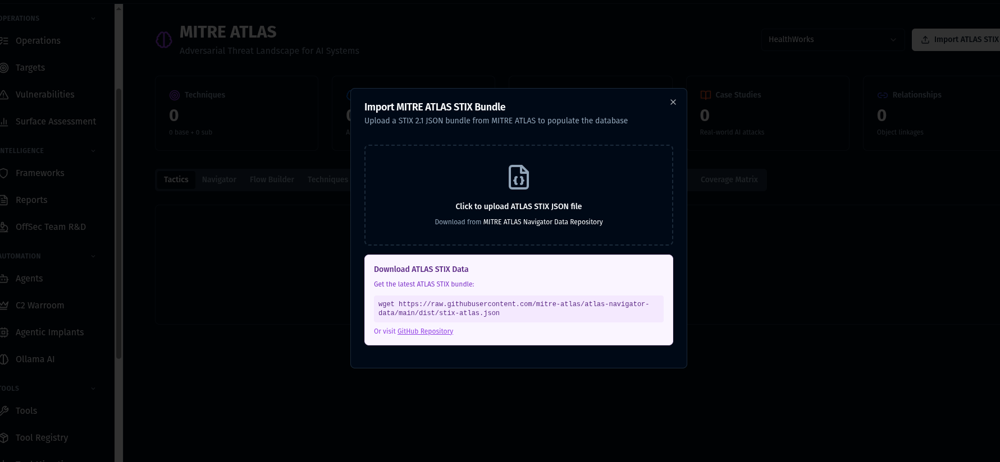

### Engineering Scaffold — Phase 7 (part 2 of 2): STIX import scheduler

- **Goal:** Auto-import MITRE ATLAS (and ATT&CK) STIX bundles on a schedule with audit.
- **Reuses:** `server/services/stix-parser.ts`, `server/services/atlas-stix-parser.ts`.
- **Work items:**
  - New seam **S7** `server/services/knowledge/stix-import-job.ts` — wraps existing parsers with cron schedule + audit + idempotency.
  - Cron entries: ATLAS daily, ATT&CK weekly (configurable).
  - New `server/api/v1/stix.ts` — manual upload + manual refresh + run history.
- **API additions:**
  - `POST /api/v1/stix/import` — multipart bundle upload [admin].
  - `POST /api/v1/stix/atlas/refresh` — trigger ATLAS poll [admin].
  - `GET /api/v1/stix/runs` — recent imports.
- **Schema changes:** migration `0036_stix_import_audit.sql` — `stix_import_runs(id, source, bundle_id, taxii_collection, objects_total, objects_imported, objects_skipped, errors jsonb, started_at, finished_at)`.
- **Acceptance:**
  - ATLAS auto-import runs nightly; new TTPs appear in framework tables.
  - Manual upload deduplicates against prior run.
  - `/api/v1/stix/runs` shows history with success/failure breakdown.
- **Effort:** part of Phase 7 XL. **Flag:** shares `RTPI_CTI_ENABLED`.

---

# Infrastructure

## Improved Agent System

[Inference-Agent-Architecture](references/Inference-Agent-Architecture.md)

### Engineering Scaffold — Phase 6: Inference provider registry + vLLM/Qwen-Agent

- **Goal:** Add a vLLM-served Qwen3.5-9B path (Q6_K primary) + Qwen-Agent MCP bridge with Qwen2.5-Coder-14B Q4_K_M as a hot-swap target, alongside existing Ollama+OpenAI+Anthropic.
- **Reuses:** `server/services/ollama-ai-client.ts`, `server/services/ai-clients.ts`, `server/services/mcp-server-manager.ts`, `client/src/components/ollama/AIProviderSettings.tsx`, `server/api/v1/settings.ts`.
- **Work items:**
  - Modify `docker-compose.yml` — add `vllm-qwen` service (`image: vllm/vllm-openai:nightly`, GPU reservation, `--profile vllm`). Mount HF cache. Pin command per `Inference-Agent-Architecture.md` (`--max-model-len 131072 --reasoning-parser qwen3 --tool-call-parser qwen3_coder --speculative-config '{"method":"qwen3_next_mtp","num_speculative_tokens":2}'`).
  - New `services/qwen-agent/` directory — Python sidecar Dockerfile + `agent.py` running Qwen-Agent exposing OpenAI-compatible chat with MCP tool list discovered from `mcp-server-manager.ts`.
  - Build `rtpi-vllm` sidecar OCI artifact for Blackwell sm_120 once, pin SHA, document build command in `docs/`.
  - New seam **S1** `server/services/inference/inference-provider-registry.ts` — capability-aware (`tool_calls`, `vision`, `reasoning`).
  - New `server/services/inference/vllm-client.ts` — OpenAI-compatible client at `http://vllm:8000/v1`.
  - Refactor `ollama-ai-client.ts` and `ai-clients.ts` into provider implementations; selection logic moves to the registry. Order: vLLM → Ollama → cloud (OpenAI/Anthropic).
  - Modify `client/src/components/ollama/AIProviderSettings.tsx` — add "vLLM (Qwen3.5-9B)" provider card with endpoint URL + health probe.
  - Modify `server/api/v1/settings.ts` — persist `VLLM_BASE_URL`, `VLLM_MODEL` to `.env`; invalidate AI clients on change.
- **API additions:**
  - `GET /api/v1/inference/providers` — registered providers + capabilities.
  - `POST /api/v1/inference/providers/:id/probe` — round-trip test [admin].
  - `PATCH /api/v1/inference/providers/:id` — set default model, hot-swap target [admin].
- **Schema changes:** column adds — `agents.inference_provider_id text`, `agents.tool_choice_strategy text`.
- **Acceptance:**
  - With `--profile vllm` up, an agent message routes to vLLM and returns a Qwen3 XML tool call.
  - Stop vLLM → falls back to Ollama; Settings UI provider probe reflects state.
  - MCP tools discovered by Qwen-Agent from existing `mcp-server-manager.ts`.
  - Documented Blackwell sm_120 build command works in CI.
- **Effort:** XL (~6–8 days). **Flag:** `RTPI_INFERENCE_PROVIDER=vllm` (default off; `ollama` or `openai` retained).

## Repair Container-App Connection Bugs

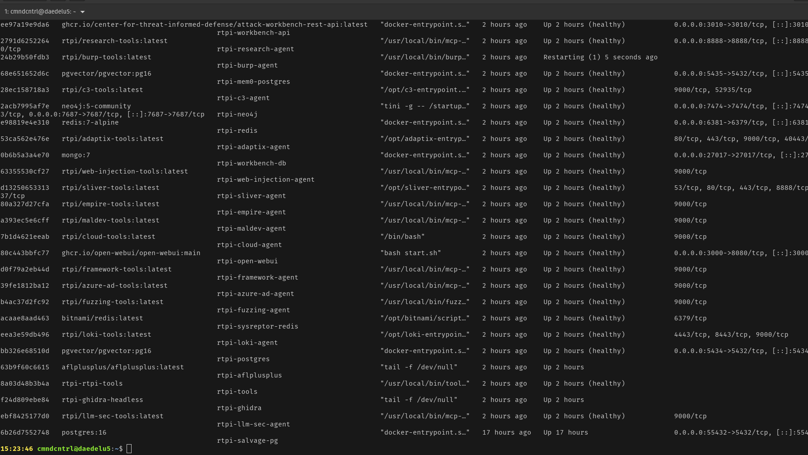

### Engineering Scaffold — Phase 5: Health-aware container exec + real MCP

- **Goal:** Replace the brittle direct-exec path with a preflight-checked runtime; replace the MCP TODO stub with a real bridge.
- **Reuses:** `server/services/docker-executor.ts`, `server/services/tool-executor.ts`, `server/services/agents/multi-container-executor.ts`, `server/services/mcp-server-manager.ts`, `server/api/v1/agent-mcp.ts`.
- **Work items:**
  - New seam **S2** `server/services/runtime/container-runtime.ts` — `inspect → preflight → exec → classify-error`.
  - New `server/services/runtime/error-classifier.ts` — error taxonomy: `ContainerNotFound`, `NotRunning`, `Timeout`, `SocketUnreachable`, `ExecFailed`. Replaces string-match `error.message.includes('timeout')` at `tool-executor.ts:193`.
  - Modify `tool-executor.ts:101-107` — call `containerRuntime.assertReady(containerName)` before `runCommand`; map `ContainerNotRunning` to 503, not 500.
  - Modify `multi-container-executor.ts` — wrap exec with structured error response `{code, retryable, remediation}`.
  - New seam **S3** `server/services/agents/mcp-invoker.ts` — JSON-RPC 2.0 MCP client; tool-list cache (60s); liveness probe every 30s writes `mcp_servers.last_probe_at`.
  - Replace TODO stub in `server/api/v1/agent-mcp.ts:54-61` with real `mcpInvoker.callTool(agent, toolName, args)`.
  - Fix `server/services/skill-import-pipeline.ts:82-443` — every terminal branch (binary, python, container) writes `githubToolInstallations`; container-build emits `deployment_events`.
  - Modify `server/api/v1/health-checks.ts` — add `GET /health-checks/containers` summary endpoint.
  - Frontend: tool result components surface structured errors instead of raw exec output.
- **API additions:**
  - `GET /api/v1/health-checks/containers`.
  - `POST /api/v1/agents/:agentId/mcp-call` — real implementation.
  - `GET /api/v1/agents/:agentId/mcp-tools` — pulled live, cached 60s.
  - `GET /api/v1/mcp-servers/:id/probe`.
- **Schema changes:** column adds — `mcp_servers.{liveness_path text, last_probe_at timestamptz, last_probe_ok bool}`; `tool_registry.{health_check_cmd text, last_health_at timestamptz, last_health_ok bool}`.
- **Acceptance:**
  - Stopping a tool container yields `{code:"not_running", retryable:false, remediation}` in UI, not a stack trace.
  - Preflight overhead <100ms on happy path.
  - `/health-checks/containers` returns each container's state.
  - MCP call returns real tool output (no longer mocked).
- **Effort:** M. **Flag:** none (bug fix); error-display flag for quick rollback if needed.

## Add "Deploy" button & automation feature
### Ensure each framework can deploy individually and collectively

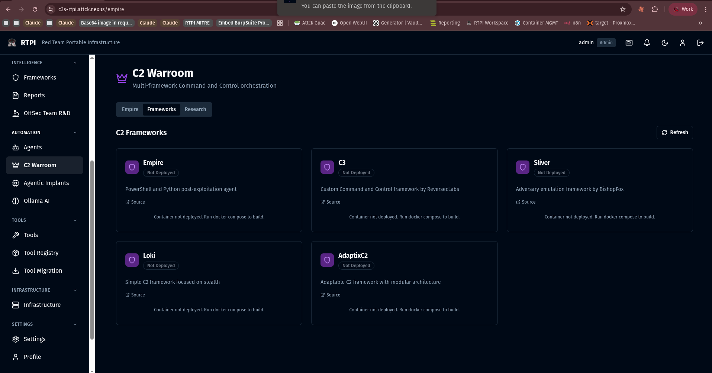

### Engineering Scaffold — Phase 9: Per-framework deploy + collective bundle

- **Goal:** Deploy any C2 framework's tooling individually (Sliver, Adaptix, C3, Loki, Empire) or all collectively from the UI.
- **Reuses:** existing always-on services in `docker-compose.yml`; `server/api/v1/c2-warroom.ts`; `server/api/v1/empire.ts`; Docker socket already mounted.
- **Work items:**
  - Modify `docker-compose.yml` — move C2 services behind per-framework profiles (`--profile sliver`, `--profile adaptix`, `--profile c3`, `--profile loki`, `--profile empire`). Default profile keeps current behavior for back-compat.
  - New seam **S5** `server/services/deployments/framework-deployment-orchestrator.ts` — `plan/up/down/health` over compose profiles.
  - New `server/services/deployments/compose-driver.ts` — pure adapter shelling out via the new ContainerRuntime (S2).
  - Manifest `server/config/framework-stacks.json` — defines bundles (e.g. "all-c2") and profile dependencies.
  - New `server/api/v1/framework-deploy.ts` — lifecycle endpoints.
  - Modify `client/src/pages/Frameworks.tsx` — Deploy/Teardown buttons per framework + collective "Deploy All C2".
  - New `client/src/pages/Deployments.tsx` (under Infrastructure) — grid of deployable units with state + history; bundle row at top.
  - Realtime: deployment events stream over existing `/api/v1/ws/agents` socket via `{kind: "deployment_event", ...}` envelope (no new socket).
- **API additions:**
  - `GET /api/v1/deployments` — list with current state.
  - `POST /api/v1/deployments/:name/up` [admin].
  - `POST /api/v1/deployments/:name/down` [admin].
  - `POST /api/v1/deployments/bundles/:name/up` — collective deploy [admin].
  - `GET /api/v1/deployments/:name/events?since=`.
  - `GET /api/v1/deployments/:name/health` — proxies ContainerRuntime checks.
- **Schema changes:** migration `0035_deployments.sql`:
  - `deployments(id, name unique, kind, compose_profile, desired_state, current_state, last_transition_at, params jsonb, health_summary jsonb, created_by)`.
  - `deployment_events(id, deployment_id fk, event_type, payload jsonb, at)`.
  - `deployment_dependencies(parent_id fk, child_id fk, pk(parent,child))`.
- **Acceptance:**
  - Click Deploy on Sliver → only the Sliver container starts; status reflects in UI.
  - "Deploy all C2" spins up the documented stack in <60s.
  - Teardown stops + records.
  - RBAC: only admin can deploy.
- **Effort:** L (~4 days). **Flag:** `FF_FRAMEWORK_DEPLOY`.

### Repair KASM Workspace (And Nested Containers)

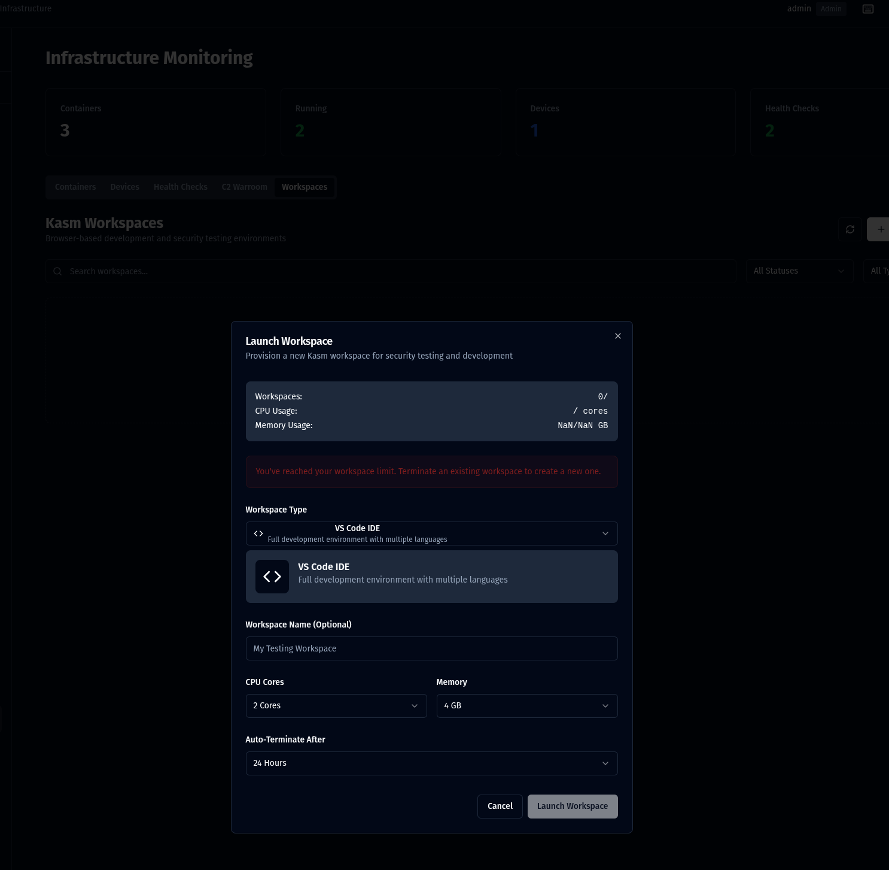

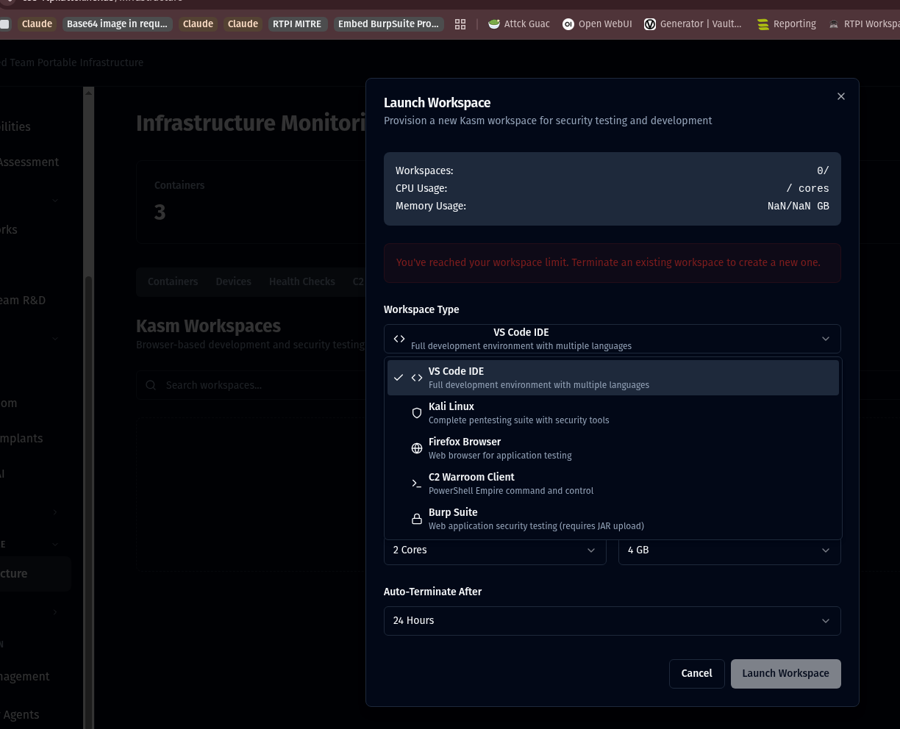

### Engineering Scaffold — Phase 10: KASM hardening + nested container helper

- **Goal:** Repair KASM workspace nested-container provisioning and harden the security boundary.
- **Reuses:** `server/services/kasm-workspace-manager.ts`, `server/services/kasm-nginx-manager.ts`, `server/api/v1/kasm-workspaces.ts`, `server/api/v1/kasm-proxy.ts`.
- **Work items:**
  - Modify `server/services/kasm-workspace-manager.ts` — replace unconditional `rejectUnauthorized: false` with cert pinning when `KASM_CA_PATH` is set; only fall back to insecure when `RTPI_KASM_INSECURE_TLS=1`. Wrap axios in a circuit-breaker (5 consecutive failures → open for 60s).
  - Modify compose service `kasm-manager` — switch raw socket mount to `docker-socket-proxy` with verb allowlist (`containers`, `exec`, `images:read`).
  - Add nested container provisioning helper in `kasm-workspace-manager.ts`: kasm-agent invokes child container via socket-proxy; new endpoint surfaces children list.
  - Reuse `kasm-db-init` pattern for an `rtpi-ca-init` one-shot that emits a CA into a shared volume.
  - Modify `client/src/pages/Infrastructure.tsx` — KASM panel with workspace list, "Spawn Nested Workspace" action, real status; warn when self-signed mode active.
  - Health surfaces in `/api/v1/health-checks` (Phase 5 endpoint).
- **API additions:**
  - `POST /api/v1/kasm-workspaces/:id/nested` — spawn nested container [operator].
  - `GET /api/v1/kasm-workspaces/:id/children` — list nested containers.
- **Schema changes:** none (state lives in KASM API + existing `kasmWorkspaces` table).
- **Acceptance:**
  - Spawning a workspace works after restart of `kasm-manager`.
  - Nested container appears as child of parent workspace.
  - Self-signed cert warning visible in UI; pinning honored when `KASM_CA_PATH` set.
  - socket-proxy denies disallowed verbs (verified by attempted call to `/networks/create` returning 403).
- **Effort:** L (~4 days). **Flag:** `FF_KASM_HARDENED` (so socket-proxy switchover is reversible).

---

# Phased Rollout

| # | Goal | Lane | Flag | Effort |
|---|------|------|------|--------|
| 0 | Feature flag scaffold + `GET /api/v1/settings/features` | infra | n/a | S |
| 1 | Sidebar reorder + `/cti` page stub | UI | none | S |
| 2 | Sysreptor health endpoint + Reports banner | reports | none | M |
| 3 | App-side PDF (puppeteer-core + chromium-shell sidecar) | reports | `FF_PDF_NATIVE` | M |
| 4 | Framework→tools/agents bindings UI + `framework_bindings` | UI | none | M |
| 5 | Container-app connection repair (preflight, classifier, MCP invoker) | container | none | M |
| 6 | Inference provider registry + vLLM/Qwen-Agent path | agent infra | `RTPI_INFERENCE_PROVIDER=vllm` | XL |
| 7 | CTI feeds + vectorization + STIX auto-import | knowledge | `RTPI_CTI_ENABLED` | XL |
| 8 | Docmost integration | reports | `RTPI_DOCMOST_ENABLED` | M |
| 9 | Per-framework Deploy button + collective bundle | container | `FF_FRAMEWORK_DEPLOY` | L |
| 10 | KASM hardening + nested containers via socket-proxy | container | `FF_KASM_HARDENED` | L |

**Parallel lanes:** UI lane (1, 4) · Reports lane (2, 3, 8) · Container/infra lane (5, 9, 10) · Agent infra (6) · Knowledge/data (7). Phase 4 must land before Phase 9 because both touch `Frameworks.tsx`.

---

# Architectural Seams

| ID | Seam | Lives in | Replaces |
|----|------|----------|----------|
| S1 | `InferenceProvider` registry | `server/services/inference/inference-provider-registry.ts` | implicit fallback in `ollama-ai-client.ts` + `ai-clients.ts` |
| S2 | `ContainerRuntime` (health-aware exec) | `server/services/runtime/container-runtime.ts` | direct `dockerExecutor.exec()` in `tool-executor.ts` |
| S3 | `MCPInvoker` (real bridge) | `server/services/agents/mcp-invoker.ts` | TODO stub in `agent-mcp.ts:54-61` |
| S4 | `FrameworkBinding` | `server/services/frameworks/framework-binding-service.ts` | new — bridges frameworks ↔ tools/agents |
| S5 | `Deployment` orchestrator | `server/services/deployments/framework-deployment-orchestrator.ts` | new — lifecycle for compose profiles |
| S6 | `KnowledgeIngestor` | `server/services/knowledge/cti-feed-ingestor.ts` | new — TAXII/RSS/JSON → embeddings |
| S7 | `STIXImportJob` | `server/services/knowledge/stix-import-job.ts` | wraps existing STIX parsers with scheduling + audit |
| S8 | `DocumentRenderer` | `server/services/reports/document-renderer.ts` | uncomment-and-replace in `pdf-report-generator.ts:18` |
| S9 | `ApiQueryClient` (frontend) | `client/src/lib/query.ts` | opportunistic — only new/touched surfaces |
| S10 | `SidebarNav` data module | `client/src/config/nav-groups.ts` | inline array in `Sidebar.tsx:52-113` |

---

# Critical Files Index

Read these before starting any phase:

```
client/src/components/layout/Sidebar.tsx
client/src/pages/Frameworks.tsx
client/src/pages/Reports.tsx
client/src/pages/OWASPLLMFramework.tsx
client/src/components/ollama/AIProviderSettings.tsx
client/src/lib/api.ts
server/api/v1/sysreptor.ts
server/api/v1/framework-mappings.ts
server/api/v1/agent-mcp.ts
server/api/v1/settings.ts
server/services/sysreptor-client.ts
server/services/pdf-report-generator.ts
server/services/atlas-stix-parser.ts
server/services/stix-parser.ts
server/services/ollama-ai-client.ts
server/services/ai-clients.ts
server/services/tool-executor.ts
server/services/docker-executor.ts
server/services/kasm-workspace-manager.ts
shared/schema.ts
docker-compose.yml
docs/enhancements/2.9/references/Inference-Agent-Architecture.md
```

---

# Risk Register

1. **vLLM Blackwell sm_120 build (Phase 6)** — nightly source build, no prebuilt wheels for RTX 5060 Ti. *Mitigation:* build `rtpi-vllm` sidecar OCI artifact once, pin SHA; gate behind `RTPI_INFERENCE_PROVIDER=vllm` so failure does not block other phases. Document fallback: Ollama tool calling for Qwen3.5 has known template bugs (per architecture doc), so cloud OpenAI/Anthropic stays on as ultimate fallback.
2. **Puppeteer Linux deps (Phase 3)** — Chromium adds ~300MB and apt sandbox flags to image. *Mitigation:* `puppeteer-core` + `chromium-headless-shell` sidecar service on private network. Never bundle Chromium into `rtpi-orchestrator` image.
3. **Docker socket exposure (Phases 9 + 10)** — raw socket widens blast radius as deployment surface grows. *Mitigation:* `docker-socket-proxy` with explicit verb allowlist; admin-only RBAC; audit-log every deploy/teardown via `deployment_events`.
4. **CTI ingestion volume + HNSW rebuild (Phase 7)** — TAXII feeds can yield millions of indicators. *Mitigation:* per-feed rate limit, retention TTL on `cti_items`, partition-by-month, embed only items above relevance threshold.
5. **Sysreptor profile inactive (Phase 2)** — health endpoint must distinguish "profile not enabled" vs "service crashed" or remediation copy will mislead. *Mitigation:* probe compose-config at startup; surface `{up, profileEnabled, version}` triple.

---

# Verification Checklist

- **P0** `curl /api/v1/settings/features` returns flag map; flipping env var changes one entry without rebuild.
- **P1** Sidebar order: Offsec R&D → CTI → Frameworks → Reports; `/cti` returns 200; a11y tree unchanged.
- **P2** `docker compose stop sysreptor` → UI red banner with reason; restart → green; no 500s.
- **P3** `POST /api/v1/reports/:id/pdf` → `jobId`; polling completes; downloaded PDF opens; mid-job restart leaves status `failed` (not lost).
- **P4** Bind a tool to OWASP LLM01; reload → still bound; `GET /api/v1/tools/:id/frameworks` returns the binding; same flow for NIST AI RMF and CIS v8.
- **P5** Stop a tool container → UI shows structured error `{code:"not_running", retryable, remediation}` (not stack trace); preflight overhead <100ms; `mcp-call` returns real output (no longer mocked).
- **P6** With `RTPI_INFERENCE_PROVIDER=vllm` and `--profile vllm` up, agent chat returns Qwen3 XML tool call; stop vLLM → falls back to Ollama; provider probe reflects state.
- **P7** Add an ATT&CK TAXII feed → indicators appear within 5min; `/api/v1/knowledge/search?q="phishing"` returns ranked items; ATLAS cron logs nightly run; `EXPLAIN` shows HNSW scan.
- **P8** `--profile docmost up` → `/api/v1/docmost/health` ok; "Publish to Docmost" creates a page reachable in Docmost UI.
- **P9** Click Deploy on Sliver → only the Sliver container starts; bundle "Deploy all C2" spins documented stack <60s; admin-only.
- **P10** Spawn KASM workspace → reachable; nested workspace appears as child; disallowed Docker verb via socket-proxy → 403; cert pinning honored when `KASM_CA_PATH` set.
